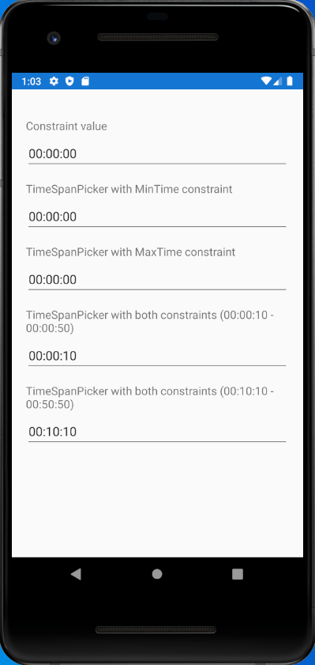

Version        | Build status     | NuGet package
---------------|------------------|----------------|
Prerelease     |  | [](https://www.nuget.org/packages/TimeSpanPicker.Forms)
Stable         |  | [](https://www.nuget.org/packages/TimeSpanPicker.Forms)

# TimeSpanPicker.Forms
A Xamarin Forms control for selecting TimeSpan values.



## Supported platforms
Supported? | Platform      
-------|--------------|
✅    | Android     
✅    | iOS
❌    | UWP

## Quickstart
Add the TimeSpanPicker.Forms NuGet package to your Xamarin Forms project:
    
    Install-Package TimeSpanPicker.Forms

The library needs to be explicitly initialized on iOS projects. Make sure you call

  ```csharp
  TimeSpanPickerRenderer.Initialize();
  ```

before initializing Xamarin Forms in the `FinishedLaunching` method of your `AppDelegate` class.

To use it from XAML markup, include the appropriate namespace:
  
  ```xaml
  xmlns:timeSpanPicker="clr-namespace:Rotorsoft.Forms;assembly=TimeSpanPicker.Forms"
  ```
 
And then you can start using the control like so:

  ```xaml
  <timeSpanPicker:TimeSpanPicker MinTime="08:00:00" MaxTime="17:00:00" Time="{Binding SelectedTime, Mode=TwoWay}" />
  ```
 
The `TimeSpanPicker` controls allows you to select the hours, minutes and seconds parts of a `TimeSpan`. You can tweak which range of values are available for picking by modifying the `MinTime` (default 00:00:00) and `MaxTime` (default 23:59:59) bindable properties. The currently selected value is stored in the `Time` bindable property.

You can also customize how the value is displayed through the `Format` property.

## Remarks
- The control only supports values in the range 00:00:00 to 23:59:59.
- Check the `SampleApp` project for a functional demo of the control.
